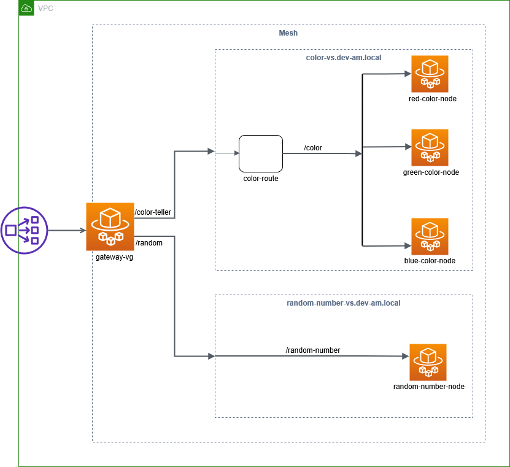

# Service Mesh using AWS App Mesh

### Architecture


### Build
###### Build application and create image in local registry
```
mvn clean package
```
###### Build application and push image to remote registry
```
mvn clean package dockerfile:push
```

### Run
###### Local
- Color Service - Red
```
Environment Variables: APP_SERVER_PORT=8000;APP_MANAGEMENT_SERVER_PORT=8001;APP_COLOR=Red
```
- Color Service - Green
```
Environment Variables: APP_SERVER_PORT=8002;APP_MANAGEMENT_SERVER_PORT=8003;APP_COLOR=Green
```
- Color Service - Blue
```
Environment Variables: APP_SERVER_PORT=8004;APP_MANAGEMENT_SERVER_PORT=8005;APP_COLOR=Blue
```
- Random Number Service
```
Environment Variables: APP_SERVER_PORT=8010;APP_MANAGEMENT_SERVER_PORT=8011
```
###### docker compose
```
docker-compose up -d
docker-compose ps
docker-compose down

docker-compose logs -f --tail="all"
```
###### AWS
Refer [this](deployment/README.md)

### Test
###### Local
- Color Service - Red
```
http://localhost:8000/color
http://localhost:8000/actuator/health
```
- Color Service - Green
```
http://localhost:8002/color
http://localhost:8002/actuator/health
```
- Color Service - Blue
```
http://localhost:8004/color
http://localhost:8004/actuator/health
```
- Random Number Service
```
http://localhost:8010/random-number
http://localhost:8010/actuator/health
```
